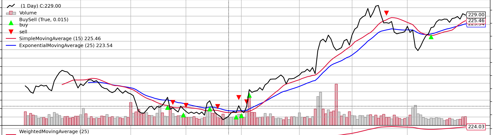
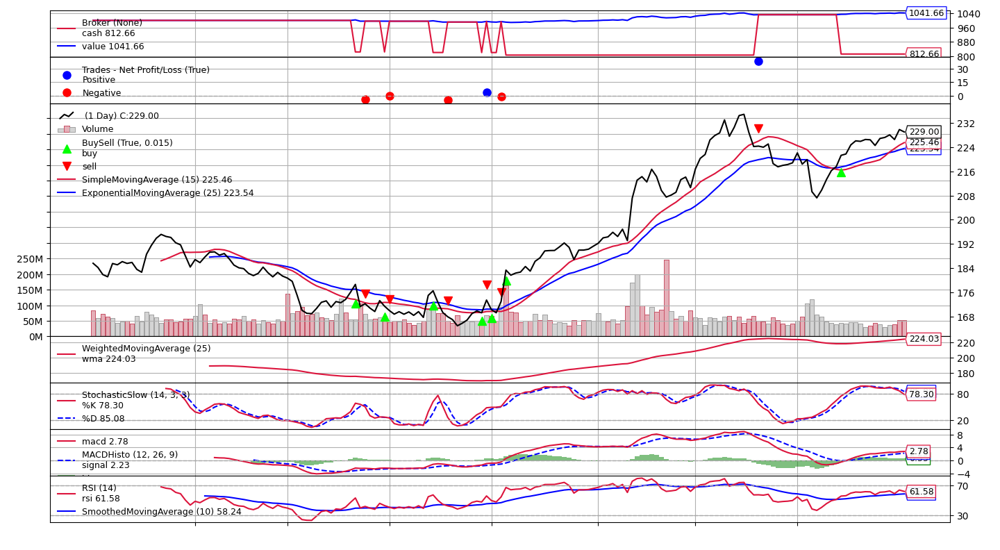

# Algorithmic Trading with Backtrader

This project demonstrates the use of the Backtrader library to implement and backtest trading strategies using historical stock data.



The strategy will attempt to buy when the current closing price is greater than the Simple Moving Average (SMA) of
 the last maperiod (default 15) bars.

Buy Signal: The strategy buys when the price crosses above the SMA. This is a common indication that the market is
trending upwards.

Sell Signal: The strategy sells when the price crosses below the SMA. This is a signal that the
market may be trending downwards.

## Project Structure

- `main.py`: The main script to load data, set up the backtrader environment, and run the backtest.
- `SMAStrat.py`: Contains the `SMAStrategy` class, which implements a simple moving average crossover strategy.
- `data/AAPL.csv`: The historical stock data used for backtesting.

## Requirements

- Python 3.x
- pandas
- backtrader

You can install the required packages using pip:

```bash
pip install pandas backtrader
````

## Usage

Run main.py, change the initial cash, dates and csv file to execute other backtests.

